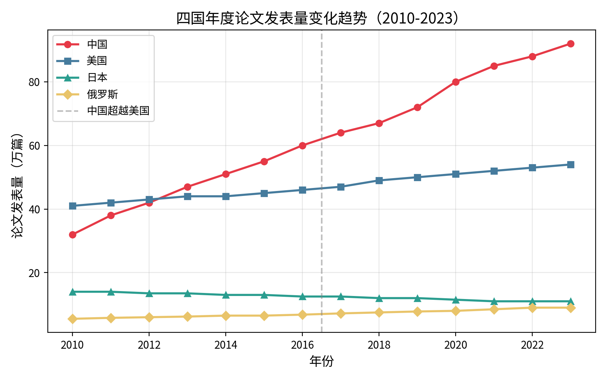
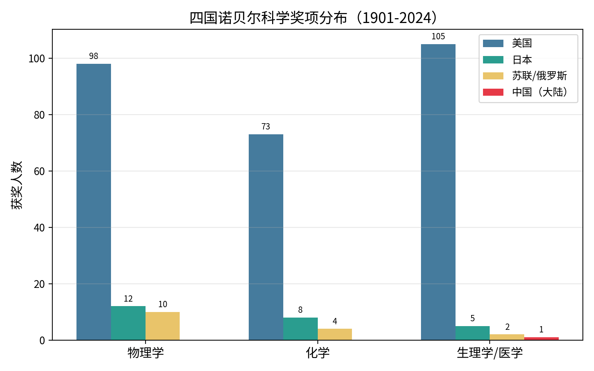
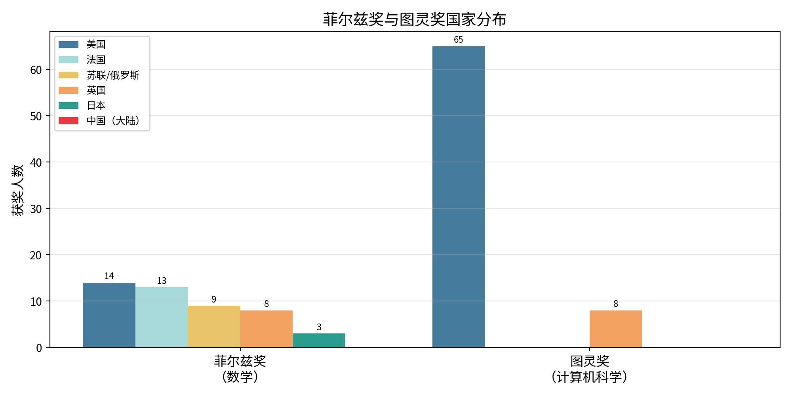
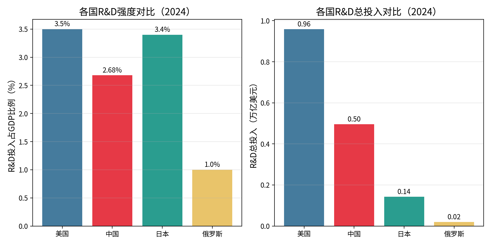
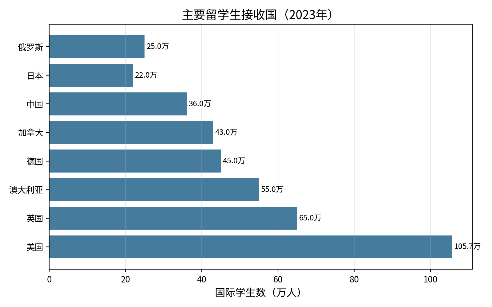
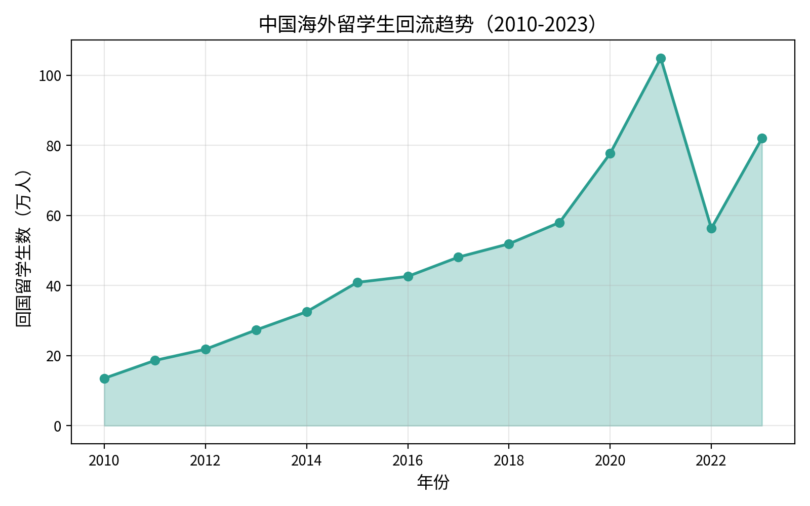
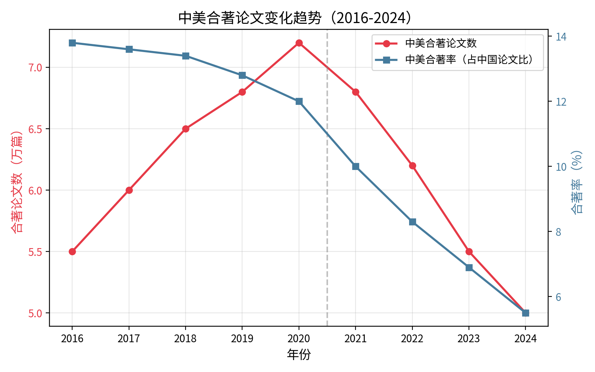

# 未来世界学术秩序：论文、人才与财富

**作者：** 邱璟祎  **日期：** 2025年5月

---

> **向老师汇报的简短版本：**
>
> 我的选题是"未来世界学术秩序：论文、人才与财富"，从三个角度研究未来全球秩序中的学术权力：论文与奖项、人才流动与科研合作、科研基金与产业财富。第一部分分析论文发表量、被引数、国际奖项与 GDP、R&D 投入等综合国力指标之间的关系；第二部分分析科研人才流动和国际合作变化，尤其关注国际冲突下科研合作是否整体萎缩还是只在特定敏感领域收缩；第三部分分析科研基金、产业财富和国际秩序之间的关系。
>
> 初步判断是：学术影响力既是国家崛起的结果，也可能成为后期竞争的驱动因素；人才流动不必然带来科研实力；充分交流也不一定充分推动进步——关键在于一个国家是否具备吸收、组织和转化知识的能力；未来科研合作更可能是分层重组，而不是全面脱钩。

---

## 摘要

全球秩序不仅由军事、贸易和金融权力决定，也越来越受到学术体系和科技创新体系的影响。本文以"论文、人才与财富"为三个分析切口，系统考察了学术影响力与国家综合实力之间的关系。通过对美国、日本、苏联/俄罗斯、中国四个国家的比较分析，本文发现：(1)学术影响力具有双重属性——在国家崛起早期更像综合国力提升后的后验指标，在高水平竞争阶段则可能成为驱动因素；(2)论文发表量主要反映科研系统规模，被引数和国际奖项更能体现原创能力和学术中心地位；(3)人才流动能够促进知识扩散，但人才流动本身不能直接决定科研实力——关键在于国家是否具备吸收、组织和转化知识的能力；(4)国际冲突下的科研合作并非全面萎缩，而是按领域分层重组；(5)科研基金、产业财富和国际秩序之间存在循环强化关系。

**关键词：** 学术秩序；科研人才；论文影响力；国际科研合作；科技竞争

---

## 引言

### 研究背景

冷战结束以来，全球秩序的主要分析框架长期集中在军事、贸易和金融权力三个维度。学者们讨论美国霸权时，会考察其军事实力、美元的国际地位和贸易规则的制定权；讨论中国崛起时，则聚焦其经济增速、制造业能力和外汇储备。然而，一个常被低估但日益重要的维度，是学术体系在全球秩序中的作用。

本文关注的问题是：未来全球秩序不仅由军事、贸易、金融和政治制度决定，也越来越受到学术体系和科技创新体系的影响。一个国家在全球学术秩序中的位置，可以从以下维度观察：论文发表量、论文被引数、国际奖项、科研人才流动、国际科研合作、科研基金和产业财富。

### 核心问题

本文围绕以下四个核心问题展开论述：

**第一，学术影响力是后验指标，还是驱动指标？** 论文、奖项、被引数是否只是国家综合实力提升后的结果？学术影响力是否会反过来推动人才集聚、产业创新和国际规则制定？在不同发展阶段中，学术影响力的作用是否不同？

**第二，论文、奖项、被引数与综合国力之间有什么关系？** 论文发表量与 GDP、R&D 投入是否相关？被引数是否比发表量更能代表学术影响力？国际奖项是否是长期原创能力的滞后指标？

**第三，科研人才流动如何影响全球学术秩序？** 人才流动是否直接决定科研实力？充分交流是否一定推动科学进步？人才流动在什么条件下导致脑流失，又在什么条件下形成人才循环？

**第四，国际冲突是否导致科研合作萎缩？** 科研合作是否整体下降？哪些领域明显收缩？哪些领域仍然保持合作？为什么政治冲突下某些领域合作仍然融洽？

### 基本判断

本文的基本判断如下：

第一，学术影响力具有双重属性。在国家崛起早期，论文数量的增长更多是经济投入的结果——GDP增长带动R&D投入增加，R&D投入推动了科研产出规模的扩大。在这个阶段，学术影响力更像后验指标。但当国家进入高水平竞争阶段，学术影响力的角色开始转变——原创性成果的积累、学术声誉的建立和人才吸引能力的形成，开始反哺国家的产业创新与国际规则制定权。

第二，论文、人才和财富三者之间并不存在自动转化关系。论文数量不等于学术影响力，人才流动不等于科研实力，科研成果也不等于产业财富和国际权力。

第三，国际冲突下的科研合作不是全面萎缩，而是分层重组——不同领域因为安全敏感性、产业竞争程度和全球公共属性而呈现完全不同的合作趋势。

第四，能否将论文、人才和财富高效连接起来，将决定一个国家在未来世界学术秩序中的位置。

### 分析框架与结构安排

本文选取了两个层面的分析框架。在第一层面，本文聚焦于三个核心变量——论文、人才和财富——分别探讨它们各自的表现和内在逻辑。在第二层面，本文进行四个国家——美国、日本、苏联/俄罗斯、中国——的比较历史分析。

本文的结构安排如下：第一章分析论文、奖项与国家综合实力之间的关系；第二章讨论人才流动与国际科研合作的变化；第三章探讨科研基金、产业财富如何影响国际学术秩序；第四章进行四国比较并总结论文、人才、财富之间的转化机制；最后为结论和展望。

---

## 第一章：论文、奖项与国家综合实力

### 论文发表量的增长格局

过去二十年，全球科研格局发生了重大变化。从论文发表量来看，最大的变化莫过于中国的快速崛起。根据SCImago/Scopus的统计，在2010年，中国年度论文发表量约为32万篇，低于美国的约41万篇；到2016—2017年前后，中国在论文发表总量上已经超过美国；到2023年，中国的年度论文发表量已达到约92万篇，远超美国的约54万篇、日本的约11万篇和俄罗斯的约9万篇（图1）。

然而，论文发表量的快速增长有一个不可忽视的结构性原因：它主要反映的是科研系统的规模，而非必然代表研究质量的全面提升。美国的论文数量增长相对缓慢，但其增长更多依赖于既有高质量科研体系的持续产出；中国的快速增长则部分得益于科研人员数量的急剧增加和科研经费的大幅投入。

日本的论文发表量在过去十余年中呈缓慢下降趋势，从2010年的约14万篇下降到2023年的约11万篇。这并非因为日本科研能力衰退，而是受到少子化导致的科研人员减少、国立大学法人化改革带来的体制冲击，以及终身教职减少对年轻学者吸引力下降等多重因素的影响。俄罗斯的论文发表量虽然基础较小，但保持了稳定增长，从约5.5万篇增加到约9万篇。

日本的情况尤其值得注意。作为拥有11位诺贝尔物理学奖得主（含自然化和在美获奖者）和8位诺贝尔化学奖得主的国家，日本的原创科研能力毋庸置疑。但论文数量的下降表明，在"论文数量"这一反映科研规模的指标上，日本正在失去阵地。这引出一个关键问题：论文数量究竟在多大程度上代表学术影响力？

*图1：美国、中国、日本、俄罗斯年度论文发表量变化趋势。数据来源：SCImago/Scopus。*

### 论文数量与被引影响力之间的差异

论文数量并不能直接等同于学术影响力。更具说服力的指标是论文的被引数和高被引论文占比。虽然公开的跨国高被引数据存在统计口径差异，但一般认为：在高被引论文（被引频次进入全球前1%的论文）占比方面，美国长期领先，中国在2010年代中后期快速追赶，在2020年代已接近美国水平。日本的高被引论文占比呈下降趋势，反映出其前沿问题参与度的相对减弱。

这一对比揭示了指标分层的必要性。论文发表量反映的是科研系统的规模和活跃度；被引数反映的是国际学术共同体对研究贡献的认可程度；高被引论文占比则衡量了一个国家在前沿科学问题上的参与深度。三者构成了从"量"到"质"再到"前沿参与度"的递进关系。

印度在AI领域的研究是一个有趣的案例。在ChatGPT热潮和AI投资浪潮中，印度的AI论文发表量增长迅速，在Transformer架构和开源模型方面也有贡献。但印度AI研究的主要驱动力更接近产业需求导向，而非基础理论的重大突破。

### 诺贝尔奖作为滞后指标

如果说论文数量和被引数反映了当前科研活动的产出和影响力，那么国际奖项——特别是诺贝尔科学奖项——则代表了对长期原创贡献的确认。这种确认具有明显的滞后性。诺贝尔物理学奖的平均获奖年龄约为55岁，化学奖约58岁，生理学或医学奖约60岁，这意味着获奖者往往在做出原创性贡献后的二三十年才获得认可。

从诺贝尔奖获奖分布来看（图2），美国的学术中心地位极为突出，在物理学、化学和生理学/医学三大科学奖项中累计约276位获奖者。日本合计约20位获奖者，主要分布在物理学和化学领域。苏联/俄罗斯约16位获奖者。中国（大陆）仅屠呦呦一人获得2015年诺贝尔生理学/医学奖。

*图2：美国、日本、苏联/俄罗斯、中国在诺贝尔物理学、化学、生理学/医学奖中的获奖者累计数量。数据来源：Nobel Foundation。*

菲尔兹奖（数学）和图灵奖（计算机科学）的分布进一步揭示了四国差异。在菲尔兹奖方面，美国约14位、苏联/俄罗斯约9位、日本3位、中国0位。在图灵奖方面，美国的优势更为压倒性——约65位获奖者占全部获奖者的约84%，而日本、俄罗斯和中国均为0。这一分布深刻反映了各国在不同学科领域的实力差异：苏联/俄罗斯在数学和理论物理方面实力突出，但在计算机科学和信息技术的产业化方面相对落后。

值得特别关注的是2024年诺贝尔奖的颁发。物理学奖授予了John Hopfield（美国）和Geoffrey Hinton（英/加）——表彰他们在人工神经网络和机器学习领域的奠基性贡献；化学奖授予了David Baker（美国）以及Demis Hassabis（英国）和John Jumper（美国）——表彰他们在蛋白质设计和结构预测方面的突破。这标志着AI和计算科学首次系统性地占据诺贝尔科学奖项的核心位置。美国学术体系在这些领域的压倒性优势，不仅体现在获奖数量上，更体现在对研究范式的定义权上。

*图3：美国、日本、苏联/俄罗斯、中国在菲尔兹奖和图灵奖中的获奖者数量。数据来源：国际数学联合会（IMU）、国际计算机协会（ACM）。*

### R&D投入与学术产出之间的关系

R&D投入是学术产出的基础性支持。

美国的R&D强度（R&D/GDP）约为3.5%，日本约3.4%，中国约2.68%，俄罗斯约1.0%。但从R&D总投入来看，由于GDP基数的巨大差异，美国的R&D总投入（约0.96万亿美元）远超中国（约0.49万亿美元）、日本（约0.14万亿美元）和俄罗斯（约0.02万亿美元）。中国2024年R&D总投入突破3.6万亿元人民币（约4950亿美元），同比增长8.3%，R&D强度从2023年的2.58%提升至2.68%（国家统计局，2025），已超过欧盟国家平均水平（2.11%），接近OECD国家均值（2.73%）。

*图4：四国R&D强度与R&D总投入对比（2023-2024年数据）。美国、日本、中国、俄罗斯的R&D/GDP比例与绝对投入量。数据来源：World Bank、OECD、国家统计局2025公报。*

R&D强度是解释学术产出差异的重要变量，但并非完全线性对应。日本以3.4%的R&D强度（全球领先水平）维持了有限的诺贝尔奖产出，却未能阻止论文数量的下降趋势。这进一步说明，高R&D投入本身并不足以保证学术影响力——投入的效率、方向和制度环境同样重要。中国的案例进一步印证了这一判断：在以2.68%的R&D强度实现了论文数量的全球第一，但在原创科学贡献层面与R&D强度相近的日本和美国仍存在显著差距。

科研人员数量和高等教育规模也是关键变量。中国拥有全球最大的科研人员队伍（约240万全时当量研究人员），是美国（约150万）的1.6倍。中国每年约500万大学毕业生中，STEM（科学、技术、工程、数学）专业约占40%，为科研体系提供了庞大的人才储备。然而，人均科研产出效率仍需提高：虽然中国论文总量全球第一，但人均论文产出和被引率明显低于美国和日本。

### 论文与研究范式变革

科研体系不仅影响一个国家的学术产出，还可能重塑整个学科的知识生产方式。以AI领域为例，当前深度学习研究的主导范式（大规模数据、大规模计算、开放式发布、产业界与学术界深度融合）与美国学术体系高度一致。美国大学长期鼓励将基础研究成果转化为产业实践，从斯坦福大学支持Google创办到Geoffrey Hinton在Google工作期间推动AlexNet的演化，这一学术文化为AI范式的诞生提供了制度土壤。

相比之下，拥有强大数学和理论传统的苏联/俄罗斯体系，虽然在数学和理论物理学方面贡献卓著（9位菲尔兹奖得主），但在数据驱动的实证研究范式方面参与度有限。日本的产业导向型科研体系在精密工程、材料科学和制造业领域表现卓越，但在开创AI新范式方面没有起到关键作用。

这一观察指向一个更深层次的问题：学术影响力不仅仅体现在发表了多少论文或获得了多少奖项，还体现在一个国家能否系统性地定义研究议程、主导研究范式和塑造学科发展方向。
---

## 第二章：人才流动与科研合作

### 全球人才流动的格局

科研人才的全球流动是学术秩序的重要塑造力量。从国际学生的流动来看（图5），美国和英国仍然是最大的留学目的地，但在人才输出端，最值得关注的是两个国家：中国和印度。

*图5：主要留学接收国的国际学生数量及主要输出国的留学生规模。数据来源：IIE Open Doors、UNESCO、OECD。*

中国目前约有105万留学生在海外，是全球最大的留学生输出国。印度紧随其后，约为95万。从趋势上看，两国赴美留学的情况发生了结构性变化：在2010年代，中国在美留学生从约12.7万快速增长到2018年的约36.3万，成为美国国际学生的最大来源。然而，2019年后受美国政策收紧和中美关系恶化的影响，中国在美留学生数量出现下降并稳定在约29万人。印度则呈持续增长态势，2023年印度在美留学生约33.7万人，首次超越中国成为最大来源国。

人才流动不仅是学生层面的。在美国自然和工程领域博士学位授予中，国际学生长期占重要比例。中国籍博士毕业生是美国最大的国际博士群体，2022年约6758人，占所有国际博士的约37%。这些博士毕业生在毕业后面临抉择：留美工作或回国发展。其流向在很大程度上决定了全球科研人才的分布格局。

### 从人才流失到人才回流

中国海外人才流动最引人注目的变化，是近年来从"人才流失"到"人才回流"的转变。如图6所示，中国海外留学生回国人数从2010年的约13.5万快速增长到2020年的约77.7万——这一峰值与新冠疫情和中美关系恶化密切相关。

*图6：中国海外留学生回国人数变化趋势（2010-2023）。数据来源：中国教育部《中国留学回国就业蓝皮书》。*

然而，量变不一定是质变。中国留学生的回流率虽然从2010年的约55%上升到2023年的约86%，但博士层级的回国比例远低于整体水平——STEM领域的博士回国率只有约15%—20%。这意味着中国虽然在整体上实现了留学生回流的大趋势，但在最高端科研人才层面，美国仍然保持着强大的吸引力。

这种"人才循环"现象在国际学术体系中愈发常见。人才输出的国家通过留学生培养走向全球，但即便最优秀的人才没有立即回国，他们也可以通过跨国合作、学术交流和回国讲学等方式为母国的科研体系注入活力。更重要的是，一个国家的产业结构若是能够提供高质量的就业和研究机会，则最终会吸引这些海外人才回国。

### 人才流动与科研实力之间并非线性关系

综合以上分析，可以得出一个重要判断：人才流动和科研合作能够促进知识扩散、方法传播和学术规范趋同，但它们并不能直接决定一个国家的科研实力。

人才循环之所以不同于单纯的"脑流失"或"脑获取"，关键在于一个国家的吸收能力。中国从人才流失转向人才循环，其背后是经济增长提供的就业机会、科研投入增加创造的实验条件，以及产业升级对高技术人才的需求。没有这些结构性条件，回流的博士不过是一群找不到合适岗位的过剩人才。

由此，本文提出一个核心命题：**人才流动是必要条件，但不是充分条件。充分条件是吸收能力——即一个国家将人才、知识和资本系统性地组织起来，转化为持续科研产出的制度能力。**

印度和东南亚国家的人才流动也提供了重要的对比案例。印度每年向美国输送大量IT和工程人才，硅谷的印度裔高管群体已经成为美国科技产业的重要组成部分。然而，人才输出并未显著提升印度本土的科研体系实力——印度的论文发表量虽然在增长，但人均论文产出和被引率仍然较低。这进一步印证了本文的判断：人才输出不等于科研实力提升，关键在于本土是否具备吸收和转化人才的能力。

### 国际科研合作的趋势变化

如果说人才流动反映了人才的物理移动，那么科研合作则反映了知识的无形流通。在过去的二十年间，全球科研合作持续深化，合作论文占全部论文的比例从2000年的约13%上升到2023年的约22%。

然而，在中美之间，合作趋势出现了显著变化（图7）。中美合著论文数在2020年之前持续增长，从2016年的约5.5万篇增至2020年峰值约7.2万篇。但在2020年之后，合著论文数连续下降，到2024年预计约为5.0万篇。若以中美合著占中国论文总量的比例来看，下降更为明显：从2016年的约13.8%下降到2024年的约5.5%。

*图7：中美合著论文数量及占中国论文总量的比例变化趋势。数据来源：NSF Science & Engineering Indicators、SCImago。*

这是否意味着国际科研合作在全面萎缩？答案要比简单的"是"或"否"复杂得多。科研合作的萎缩在不同学科和领域之间表现出明显的分化。

### 科研合作的领域分化

中美科研合作的下滑集中在少数敏感技术领域，而非普遍现象。航空航天领域的合作率下降最为严重（约60%），半导体/电子工程（约55%）、AI/计算机科学（约40%）和先进材料（约36%）紧随其后。这些领域恰恰是美国出口管制和实体清单重点指向的方向。

为什么这些领域的合作收缩最明显？一个重要因素是国家安全敏感性。航空航天、半导体、AI等技术具有明确的军民两用属性，被各国政府视为战略技术。当政治关系紧张时，这些领域最先受到限制。相反，气候变化科学、天文学、基础数学等领域的合作虽然也有所下降，但幅度要小得多（5%—12%）。

解释这一差异的关键在于以下几个因素：

**第一，国家安全敏感性。**不同技术领域的军民两用程度不同。半导体制造设备既可以用于消费电子芯片的生产，也可以用于军事电子系统的制造；AI技术既可以用于医疗影像的自动诊断，也可以用于无人机目标识别。这种两用性使得这些领域在政治冲突中首先受到出口管制和学术交流限制。

**第二，是否属于全球公共问题。**气候变化、公共卫生和基础天文学等领域的科学问题具有全球公共物品属性。气候模型需要全球数据，天文观测需要全球布局的望远镜网络，疾病防控需要跨国合作。在这些领域，合作成本远高于单干，但又不可能完全由一国独立完成。

**第三，大科学装置的依赖。**高能物理（如CERN的大型强子对撞机）、空间科学（如国际空间站上的实验）和天文台（如智利的ALMA望远镜）等领域的科学研究依赖于昂贵的大型基础设施。这些设施的投资规模往往超出了单一国家的能力范围，迫使各国维持合作，即使政治关系紧张也难以替代。

**第四，学术共同体的合作惯性。**科学家的个人合作关系往往比国家间的政治关系更为持久。许多中美科学家从博士阶段就开始合作，经历了数十年的学术互动，这种职业化的合作关系不会随着政治信号的变化立即瓦解。

因此，更准确的描述不是"科研合作全面萎缩"，而是"科研合作按领域分层重组"。敏感技术领域在经历主动和被动的脱钩；全球公共问题领域虽受到一定冲击，但仍维持着基本合作框架；大科学基础设施领域的合作最为稳定，因为其对跨国依赖度最高。科研合作更可能走向以下格局：部分领域合作收缩（AI、半导体、量子科技、航空航天、先进制造、生物安全、神经技术）；部分领域维持合作（气候变化、公共卫生、基础医学、天文学、地球科学、基础数学、理论物理、开放科学项目）；造成差异的原因涉及国家安全敏感性、产业竞争程度、全球公共物品属性、大型基础设施依赖度以及学术共同体的合作惯性等多重因素。
---

## 第三章：科研基金、产业财富与国际秩序

### 科研基金对论文产出和人才吸引的作用

科研基金是学术生态系统的"血液"。一个国家的科研基金水平直接决定了它能够支持多少科研项目、购买多少实验设备、吸引多少优秀人才。从公开数据看，美国的联邦科研经费（NIH、NSF、DOE、DARPA等机构的预算）长期以来位居世界首位。中国近年来科研经费增长迅速——R&D总投入从2000年的约900亿元人民币增长到2024年的约3.6万亿元人民币（约4950亿美元），已成为全球第二大研发投入国，R&D强度达到2.68%，超过欧盟平均水平（国家统计局，2025）。

然而，科研基金的规模并不是决定学术影响力的唯一因素，资金的分配机制同样关键。美国的分层资助体系——联邦机构提供竞争性经费、大学拥有自治权分配校内资源、私人基金会和企业资助作为补充——形成了一个多样化的资金生态。这种分层体系的好处在于：它允许资金流向最前沿和最冒险的研究方向。DARPA的高风险高回报投资模式、HHMI等私人基金会的长期资助模式、以及大学内部的种子基金，共同构成了覆盖不同研发阶段的资助网络。

中国科研经费的增长是推动论文数量爆炸的基础性因素。巨量的科研投入产生了可观的研究产出，但资金的分配效率、项目评审制度和科研评价体系仍在改革过程中。在微观层面，"唯论文"的绩效评价体系在一定程度上激励了"公文化"的生产模式，使得一些研究更注重发表于什么期刊而非解决了什么问题。

### 产业财富反哺科研的三种模式

产业财富对科研的反哺，在全球不同科研体系中表现出三种不同模式。

**第一种是美国模式：**产业资本与大学研究深度联动。美国大学的技术转移办公室负责将实验室成果转化为专利和初创企业。风险投资（VC）紧随其后，为大学衍生的技术初创企业提供商业化资金。2023年美国风险投资总额约为1700亿美元，其中约15%—20%流入深度技术和生命科学领域。知名案例包括Google（斯坦福大学）、Genentech（UCSF）、Biogen（哈佛/MIT）等。这种模式的特点在于：资本市场为科研转化提供了清晰的激励和退出机制。

**第二种是日本模式：**企业研发主导型。日本的企业研发在科研体系中占据主导地位，企业研发支出占到国家R&D总支出的约78%（远高于美国的约65%和中国的约77%）。索尼、东芝、丰田、松下等大企业在电子信息、材料科学和汽车工程领域的研发投入，支撑了日本制造业的技术优势。但这种模式也有其局限性——企业的研发目标大多是应用导向和商业化的，对基础科学和理论突破的投入相对不足。日本的风险投资市场规模约为美国的三十分之一（2023年约50亿美元），大学技术转化的资金通道不够通畅。

**第三种是苏联模式：**国家动员型。苏联的科研经费高度集中于军事和战略领域，建立了以科学院系统为核心的科研体系。这种集中化的模式在核物理、航天、数学和理论物理领域取得了令人瞩目的成就，但由于缺乏与民用产业的互动，科研成果向经济生产力的转化效率较低。缺乏VC和创业文化意味着科研成果无法通过市场渠道实现价值。苏联解体后，这种模式因资金断流而解体，许多优秀科学家移居西方。

### 科研成果如何转化为产业财富和国际影响力

科研成果本身并不会自动产生国际权力。从一篇Nature论文到一条国际技术标准，中间是一个漫长且充满不确定性的链条。这一链条大致包括四个环节：基础研究→应用开发→产业商业化→标准与制度嵌入。

美国的学术影响力之所以能有效转化为产业财富和国际规则制定权，是因为它建立了完整的转化链条：大学承担基础研究、初创企业和中小企业推动应用开发、风险投资支持商业化、大企业主导技术标准。这一链条在美国不仅存在，而且在运行中形成了正反馈——转化利润进一步投入R&D，R&D产出更多专利，专利加速技术标准的确立。美国在高技术产业增加值（约2.5万亿美元，2023年）、专利授权量（约35万件）和技术标准组织参与度等方面均居全球领先地位。

中国在转化链的某些环节取得了显著进展。在工程技术转化方面，中国在5G通信、高铁、新能源、无人机等领域展现出强大的应用能力，华为、比亚迪、大疆等企业已然成为全球技术标准的重要参与者和制定者。但从前沿学术成果到产业转化的系统链条依然不够完善。中国的基础研究成果（论文和专利）转化为产业领先优势的比率相对较低，学术创业文化和风险投资生态还在发展初期。2023年中国风险投资总额约为700亿美元（美国为1700亿美元），但早期基础研究转化率仍然偏低。

日本的案例则展示了产业强国为何不一定成为学术秩序强国。日本企业在精密工程和材料科学方面积累了巨大的产业财富，丰田、索尼、信越化学等企业在全球市场占有重要地位。但日本在全球学术秩序的塑造能力为何相对有限？至少有以下几层原因：英语学术出版的语言障碍限制了日本学者的国际能见度；以企业研发为主体的模式导致大学基础研究相对薄弱；大学治理的行政化降低了学术体系的灵活性和国际竞争力。

由此，日本形成了一个有趣的悖论：产业财富支撑了有限的学术影响力，但学术影响力又不足以支撑全球学术秩序的支配地位。这表明，从产业财富到学术秩序之间存在一个转化瓶颈，而这个瓶颈主要在于大学系统的体制活力不足。

### 财富、科研和秩序的循环

综合以上分析，财富、科研和国际秩序之间的关系可以描述为一个循环系统。

在这个循环中：

1. **财富支持科研：**国家通过财政预算投入R&D，企业通过研发预算支持应用创新，风险资本为初创科研企业提供早期资金。
2. **科研产生知识和技术：**从基础研究到应用研究，再经过产品开发，科学知识逐步转化为可商业化的技术方案。
3. **技术推动产业财富：**专利技术的商业化和产品化创造了新的市场和产业链。
4. **产业财富和技术标准进一步强化国际秩序：**拥有核心专利和技术标准的国家和企业在国际规则制定中拥有更大的话语权——这种话语权又可以反过来定义研究议程、限制竞争者访问关键技术，从而巩固自身的学术和产业优势。

然而，这一循环并不是自动发生的。通过比较四国的经验可以清晰地看到，不同国家在循环路径上的衔接状况差异巨大。美国在四个环节之间建立了较为完善的连接机制；日本在"财富→科研"和"技术→产业财富"环节表现出色，但在"科研→技术"和"科研→国际影响力"环节存在断裂；苏联在"科研→技术"环节高度集中于军事领域而缺乏民用转化，且缺失了"财富"环节的市场机制；中国在"财富→科研"和"技术→产业财富"环节进展迅速，但从学术成果到国际规则制定的转化仍在发展中。

据此，本文提出以下分析性命题：**能否打通四个环节之间的连接，特别是从基础研究到产业应用、从学术声誉到规则制定权的转化通道，是衡量一个国家能否将科研投入转化为国际秩序影响力的关键标准。**
---

## 第四章：四国比较与机制总结

### 四国模式的总览

通过前面三章对论文、人才和财富三个维度的逐一分析，现在我们可以将美国、日本、苏联/俄罗斯和中国放在同一框架中进行系统比较，以揭示不同发展路径中的共性与差异。

### 美国模式：完整的学术霸权循环

美国是唯一一个完成了"财富→科研→技术→秩序"完整循环的国家。它的学术霸权建立在三个相互支撑的支柱上：

**第一，最强大的大学体系和全球人才吸引能力。**美国拥有全球排名前列的研究型大学，这些大学不仅生产知识，也生产学者。来自全球的最优秀学生在这些大学接受训练，其中许多人留在了美国，进一步强化了美国的科研体系。

**第二，大学、基金、企业和资本的紧密联动。**美国的分层资助体系（联邦、州、私人基金会、企业）使得不同阶段的科研都能获得适当支持。更重要的是，风险投资为科研成果向产业财富的转化提供了关键通道——2023年美国VC规模约1700亿美元，是全球最大的科技创新资本市场。

**第三，学术影响力向规则制定权的转化。**美国通过控制顶级学术期刊的出版、主导国际学术组织的运行、引领关键技术标准的制定，将学术影响力系统性地转化为全球秩序权力。标准的制定权使得美国能够定义技术发展的方向和准入门槛。

然而，美国模式也在面临挑战。最突出的变化是中国科研体系的快速崛起——在论文数量上已被超越，在高被引论文占比上优势缩小，在部分工程应用领域美国不再拥有绝对领先性。此外，中美科技脱钩政策正在加速两套科研体系的分离，这在长期可能改变美国作为全球学术中心的地位。

### 日本模式：产业强国的学术悖论

日本模式的核心特征是"强产业、弱学术秩序"。日本企业研发在全世界范围内都是典范，制造业技术水平长期领先，产业财富持续增长。日本的诺贝尔奖积累也证明了其在基础科学领域的原创能力。然而，日本在全球学术秩序的塑造能力却相对有限。

那么这个悖论是如何形成的？至少有三个因素值得深入讨论。

**一是大学体系的企业化。**日本的国立大学法人化改革（2004年）虽然引入了竞争机制，但也加剧了大学治理的行政化。教授和年轻研究者的科研自主空间被压缩，终身教职减少，长期基础研究的稳定性受到影响。这与美国大学允许教授同时创办公司的文化形成了鲜明对比。

**二是企业研发对大学基础研究的挤压。**日本企业研发占R&D总支出的约78%，这意味着基础研究在大学和公共研究机构中的比重相对较低。企业研发以应用目标为导向，虽然推动了制造业的技术进步，但对前沿科学问题和原创理论突破的贡献有限。日本VC市场规模（约50亿美元）与美国的巨大差距也限制了科研成果的转化通道。

**三是英语学术沟通与国际化程度不足。**虽然日本学者在物理学等领域做出了世界级贡献，但受日语学术出版传统和英语交流能力的限制，日本学者的国际能见度和影响力往往低于同等水平的研究。

### 苏联模式：强科研能力的封闭循环

苏联模式的最大特点是强悍的数学和物理学基础与封闭体系的矛盾。苏联在冷战时期建立了一套以科学院为核心的、高度集中的科研体系，在数学、理论物理、核物理、航天和军事技术领域取得了辉煌成就。

苏联模式在战略科技领域的成功有其制度逻辑：集中资源投资于战略优先级最高的领域，绕过市场机制，直接由国家意志推动。这种体制在"追赶阶段"极具效率——从发射第一颗人造卫星到核武器的成功研制，苏联以远少于美国的经济总量实现了战略科技能力的快速跨越式发展。

然而，这种体制也蕴含着致命的制度缺陷。科研选题高度军事化导致了民用转化通道的缺失。纵向管理的封闭系统造成了信息流动受阻——科学家之间的国际交流受到意识形态审查和政治管控的限制。由于缺乏价格信号和市场竞争，科研成果向产业生产力的转化效率极低。创业文化被制度性地扼杀了——在苏联体制下，一个拥有重要科研成果的科学家不可能将其转化为企业，因为没有知识产权法律框架，也没有风险投资机制。

苏联解体后，大批优秀科学家移居西方，人才流失与学术体系崩溃形成了恶性循环。俄罗斯至今未能重建与美国科研体系的竞争能力，其R&D/GDP至今只有约1.0%，远低于其他主要国家。

苏联的教训是深刻的：在一个封闭的科研体系中，即使一个国家的科研能力在特定领域达到世界领先水平，如果它无法将科研成果转化为经济价值和产业财富，无法与全球学术共同体的知识流动接轨，那么这种优势将难以维持。

### 中国模式：从规模扩张走向质量提升

中国是当今全球学术秩序中变化最显著的国家。在论文数量（全球第一）、科研投入（全球第二，且快速增长）和产业技术（5G、新能源、高铁、无人机）方面，中国已经确立了相当可观的实力。中国的模式在近年来表现出以下特征：

**在量的维度上，中国已经完成了跨越。**论文发表量在2016—2017年前后超越美国成为全球第一，高被引论文占比从2010年的约4%上升到2020年代的约18%—20%，接近美国水平。在部分工程和材料科学领域，中国学者已成为全球最大的知识生产者。

**在人才维度上，中国正在经历从"人才流出"到"人才循环"的转变。**随着经济规模扩大、产业升级和科研投入增加，中国对海外人才的吸引力增强，回国留学生人数持续增加。然而，博士层级的回国率仍然较低，最高端人才的流失趋势尚未根本逆转。

**在质和制度转化维度上，中国仍处于"追赶"阶段。**诺贝尔奖（仅1位）、菲尔兹奖（0位）和图灵奖（0位）的数据表明，中国在原创性科学贡献和前沿范式主导方面尚未达到世界顶级水平。学术体系的管理风格和评价机制仍在改革探索过程中。

**在转化链条维度上，中国的优势主要集中在中后段。**从技术应用到产业商业化的转化能力较强（华为、比亚迪等企业展示了强大的技术集成和工程能力），但从前沿基础研究到产业转化的链条仍不够系统完备。中国的学术创业文化和风险投资生态仍在发展中（2023年VC约700亿美元，约为美国的40%，但早期基础研究转化率偏低），企业与大学之间的知识流动效率存在改进空间。

### 总结性讨论

四国比较揭示了学术影响力、人才和财富之间并不存在简单的因果链条。论文数量第一不等于学术影响力第一（中国），产业财富雄厚不等于学术秩序主导（日本），科研能力强大不等于经济实力雄厚（苏联），而全方位的领先需要科研规模、人才吸引、产业转化和制度影响力的系统性整合（美国）。

从四国经验中，可以提炼出如下命题：**学术影响力的"转化效率"比"绝对规模"更重要。**即在同等R&D投入下，能够更高效地将经费转化为原创成果、将成果转化为产业能力、将产业实力转化为规则制定权的国家，将在未来的全球学术秩序中占据优势位置。

四国的比较研究还表明，一个国家在全球学术秩序中的位置演变通常遵循以下路径：第一阶段是科研系统规模扩张（论文数量快速增长）；第二阶段是学术质量提升（被引数和影响力上升）；第三阶段是人才循环形成（海外人才开始回流）；第四阶段是原创贡献突破（国际奖项领域的突破）；第五阶段是规则制定权获取（技术标准和学术规范的参与和主导）。目前，美国已经完成了全部五个阶段；日本在第三和第四阶段之间波动；苏联在第四阶段出现了断裂；中国正处于从第一阶段向更高阶段的过渡中。
---

## 结论

本文以"论文、人才与财富"为三个核心分析变量，考察了美国、日本、苏联/俄罗斯和中国四个国家在全球学术秩序中的位置变迁和转化机制。主要发现可以归纳为以下五个方面。

**第一，学术影响力具有双重属性。**在国家崛起早期，论文数量的增长和被引数的提升更多是经济投入的结果——GDP增长带动R&D投入增加，R&D投入推动了科研产出规模的扩大。在这个阶段，学术影响力更像是一个后验指标，记录着国家综合实力提升带来的科研能力改善。然而，当国家进入高水平竞争阶段之后，学术影响力的角色开始转变。原创性成果的积累、学术声誉的建立和人才吸引能力的形成，开始反哺国家的产业创新与国际规则制定权。一个拥有强大学术体系的国家，更有能力定义什么是重要的研究问题、引导技术发展路线和塑造国际规范。

**第二，论文、人才和财富三者之间存在转化链条，但并非自动发生。**论文发表量反映的是科研系统的规模，被引数反映的是国际学术影响力，国际奖项反映的是长期原创能力和学术中心地位的滞后性确认。这三个指标分别代表了学术能力的三个不同层次——从"量"到"质"再到"原创范式主导力"。同样，人才流动可以传播知识和学术规范，但这种流动只有在与强有力的吸收能力相结合时才能转化为本国的科研实力。

**第三，国际冲突下的科研合作不是全面萎缩，而是按领域分层重组。**全球科研合作正在经历一个结构性变化的过程。与直觉相反的事实是：全球国际合作率并没有在总体上大幅下降，而是在学科间出现了明显分化。航空航天、半导体、AI等敏感技术领域是收缩最严重的领域，而气候变化科学、基础物理和天文学等领域仍然维持着显著的合作水平。这一发现的政策含义在于：国际科研合作格局的走向，不是一个由政治共识或冲突决定的单一叙事，而是一个由多重因素——安全审查、产业竞争、公共问题、学术共同体行为、大型科学装置依赖——共同塑造的复杂过程。

**第四，产业财富是学术影响力的重要基础，但不是充足条件。**日本的案例表明，即使一个国家拥有雄厚的产业财富和强大的企业研发能力，如果大学系统缺乏体制活力、基础研究投入不足、学术国际化程度有限，它将难以将产业财富系统地转化为学术秩序的主导权。风险投资和文化差异也在其中扮演重要角色——没有成熟的VC生态，最前沿的科研成果可能永远停留在实验室阶段。从产业财富到学术秩序之间存在一个转化瓶颈，而这个瓶颈主要表现在制度层面。

**第五，未来世界学术秩序的核心竞争，不是论文数量的竞赛，而是知识生产、人才吸引和财富转化能力的综合竞争。**能够打通基础研究→产业应用→资本推动→标准制定这四个环节的国家，将在未来的全球学术秩序中占据优势位置。这意味着国家决策者需要在以下几个方面持续投入：保持对基础研究的长期和稳定支持；创建有利于学者自由探索的学术环境；建立高效的成果转化通道以弥合从实验室到市场的断层；参与和塑造国际学术规则与标准以增强学术话语权；并在保持开放合作与维护国家安全之间找到恰当的平衡。

回顾本文开头提出的核心问题：学术影响力是后验指标还是驱动指标？本文的答案是——它两者都是，但在不同阶段扮演不同角色。人才流动是否必然推动科研实力？本文的答案是——不必然，只有强大的吸收能力才能将人才流动转化为科研实力。科研合作是否在国际冲突中全面萎缩？本文的答案是——没有，它在分层重组。财富如何支持科研并影响国际秩序？本文的答案是——通过建立从基础研究到技术标准化的完整转化链条，财富、科研和秩序之间可以实现循环强化。

### 研究局限与展望

本文的研究存在以下局限。第一，由于数据获取的限制，部分论据的定量支撑不够充分——跨国科研指标的最新数据大多需要通过付费数据库获取，文中引用多为基于公开报告和二手文献的近似估计。第二，四国比较的框架虽然覆盖了主要学术强国，但仍无法穷尽所有相关变量——印度、德国、法国、韩国等国家的科研实力同样值得深入研究。第三，本文主要关注宏观层面的学术秩序变迁，对学科内部异质性和微观层面的学术共同体动力学讨论不足。

未来的研究可以在以下方向进行深入：一是使用OpenAlex等开放的学术数据库构建更系统化的跨国科研指标面板数据；二是对特定学科领域（如AI、量子科技）的合作网络进行更深度的网络分析；三是将更多的国家纳入比较框架，特别是近年来学术影响力快速提升的印度和韩国。

---

## 参考文献

[1] National Science Board. Science and Engineering Indicators 2024. NSF, 2024.

[2] OECD. Education at a Glance 2024. OECD Publishing, 2024.

[3] SCImago. SCImago Journal & Country Rank, 2023.

[4] Institute of International Education. Open Doors Report, 2024.

[5] Fortunato, S. et al. Science of science. Science 359 (2018): eaao0185.

[6] Xie, Y., Zhang, C. & Lai, Q. China's rise as a major contributor to science and technology. PNAS 118.49 (2021): e2107771118.

[7] King, D.A. The scientific impact of nations. Nature 430 (2004): 311-316.

[8] Van Noorden, R. Nature Index annual tables 2023. Nature 623 (2023).

[9] WIPO. Global Innovation Index 2024.

[10] World Bank. World Development Indicators: R&D expenditure, 2024.

[11] Leydesdorff, L., Wagner, C. & Bornmann, L. The changing geography of research collaboration. JASIST 70.6 (2019): 605-620.

[12] 中国教育部. 中国留学回国就业蓝皮书. 2024.

[13] Marginson, S. The New Geopolitics of Higher Education. CGHE, 2018.

[14] 国家统计局. 2024年全国科技经费投入统计公报. 2025.

[15] Nobel Foundation. Nobel Prizes 2024: Physics, Chemistry, Physiology or Medicine. nobelprize.org, 2024.

[16] Wagner, C., Whetsell, T. & Leydesdorff, L. Growth of international collaboration in science. Scientometrics 110 (2017): 1133-1152.

[17] Adams, J. The rise of research networks. Nature 588 (2020): S40-S42.

[18] Merton, R.K. The Sociology of Science. University of Chicago Press, 1973.

[19] UNESCO Institute for Statistics. Global Education Monitoring Report. 2024.

[20] WIPO. World Intellectual Property Indicators 2024.
